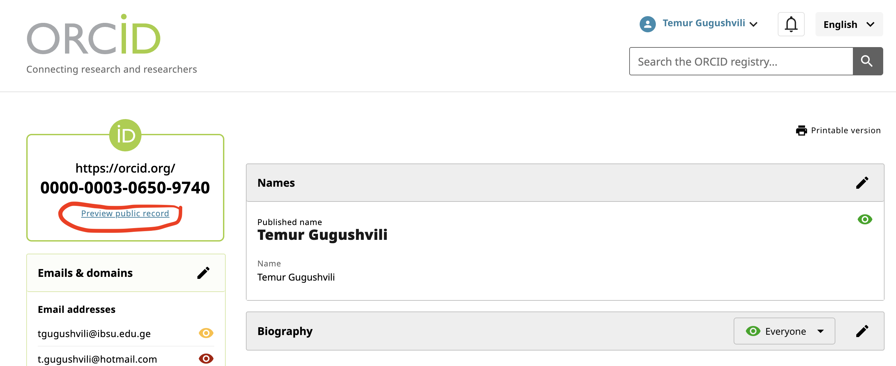
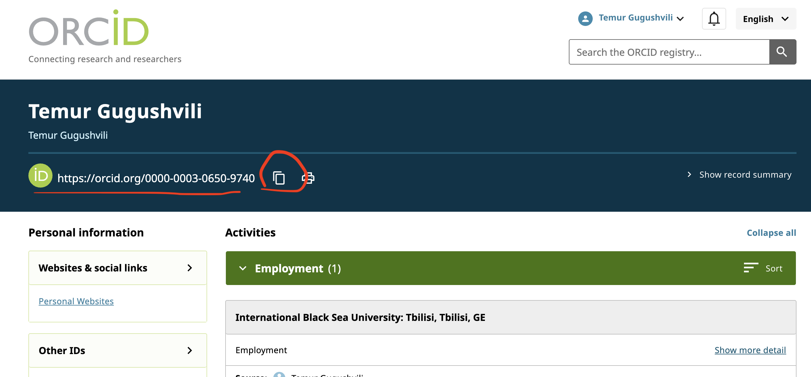
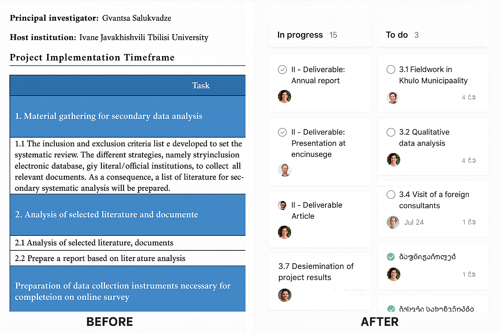
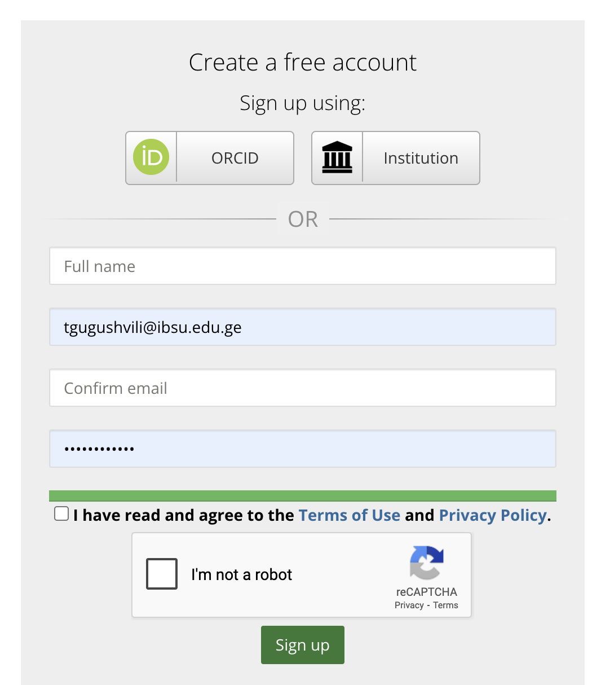
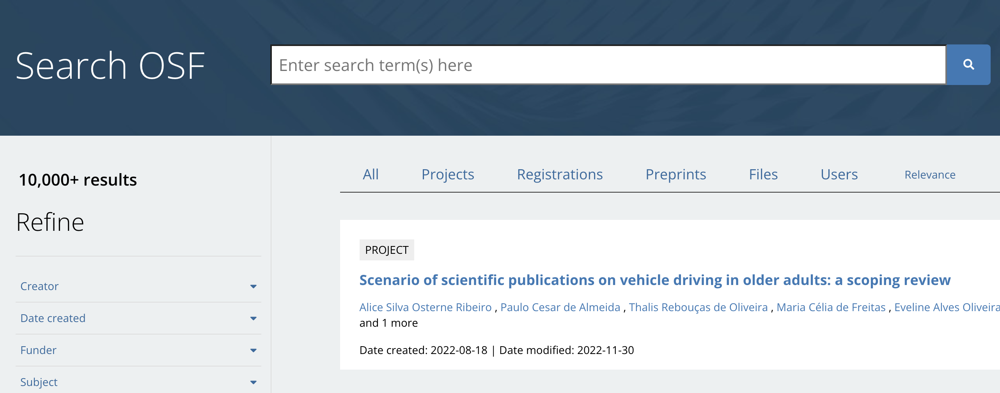
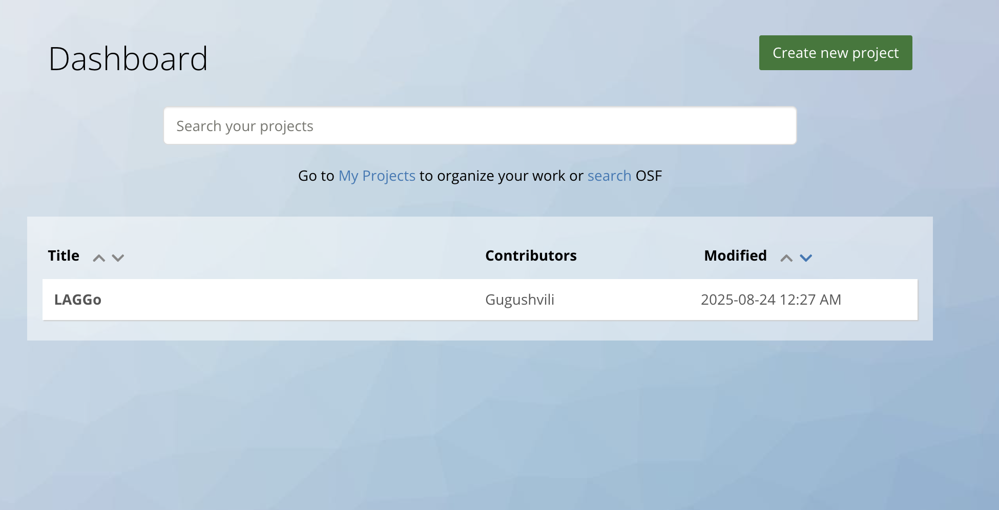
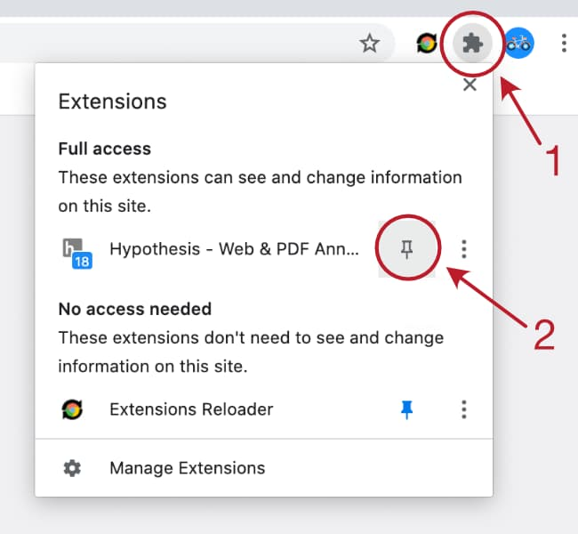
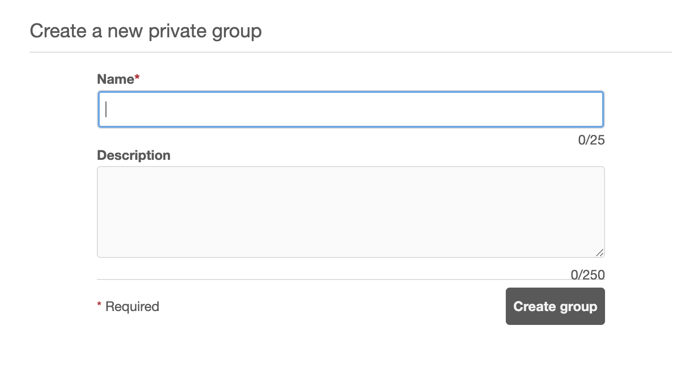

```{r setup, include=FALSE}
knitr::opts_chunk$set(echo = FALSE)
```


## SESSION 1: Building Your Digital Academic Identity  (70 minutes)

### Part A: ORCID - Your Universal Academic Identifier and profile system

<div style="position: relative; width: 100%; height: 0; padding-top: 56.2500%;
 padding-bottom: 0; box-shadow: 0 2px 8px 0 rgba(63,69,81,0.16); margin-top: 1.6em; margin-bottom: 0.9em; overflow: hidden;
 border-radius: 8px; will-change: transform;">
  <iframe loading="lazy" style="position: absolute; width: 100%; height: 100%; top: 0; left: 0; border: none; padding: 0;margin: 0;"
    src="https://www.canva.com/design/DAGxBJ1HRO8/qELLC0mSXa-sU-1nP00VCg/view?embed" allowfullscreen="allowfullscreen" allow="fullscreen">
  </iframe>
</div>
<a href="https:&#x2F;&#x2F;www.canva.com&#x2F;design&#x2F;DAGxBJ1HRO8&#x2F;qELLC0mSXa-sU-1nP00VCg&#x2F;view?utm_content=DAGxBJ1HRO8&amp;utm_campaign=designshare&amp;utm_medium=embeds&amp;utm_source=link" target="_blank" rel="noopener">SESSION 1, PART A: ORCID</a> by Gvantsa Salukvadze

**Public Profile of ORCID**

<details class="collapsible">
<summary> Copy ORCID Link  </summary>

Step 1 


{ width=80% }

Step 2

{ width=80% }

</details>


### Part B: Google Scholar & ResearchGate Integration

<div style="position: relative; width: 100%; height: 0; padding-top: 56.2500%;
 padding-bottom: 0; box-shadow: 0 2px 8px 0 rgba(63,69,81,0.16); margin-top: 1.6em; margin-bottom: 0.9em; overflow: hidden;
 border-radius: 8px; will-change: transform;">
  <iframe loading="lazy" style="position: absolute; width: 100%; height: 100%; top: 0; left: 0; border: none; padding: 0;margin: 0;"
    src="https://www.canva.com/design/DAGxBHB_ibM/dispoc5d1XYByQoWhADfEQ/view?embed" allowfullscreen="allowfullscreen" allow="fullscreen">
  </iframe>
</div>
<a href="https:&#x2F;&#x2F;www.canva.com&#x2F;design&#x2F;DAGxBHB_ibM&#x2F;dispoc5d1XYByQoWhADfEQ&#x2F;view?utm_content=DAGxBHB_ibM&amp;utm_campaign=designshare&amp;utm_medium=embeds&amp;utm_source=link" target="_blank" rel="noopener">SESSION 1, PART B: GOOGLE SCHOLAR &amp; RESEARCHGATE</a> by Gvantsa Salukvadze

Update Google Scholar with [ExCITATION](https://excitation.tech/)

### Part C: Personal Websites & Social Media for Academics

**Personal Websites - Professional online presence options**

<details class="collapsible">
<summary>  Personal Websites 1 </summary>

<iframe 
  src="https://temurgugushvili.ge/" 
  width="100%" 
  height="600px" 
  style="border:1px solid #ccc; border-radius:8px;">
</iframe>

</details>


<details class="collapsible">
<summary>  Personal Websites 2 </summary>

<iframe 
  src="https://www.normanbackhaus.ch/" 
  width="100%" 
  height="600px" 
  style="border:1px solid #ccc; border-radius:8px;">
</iframe>

</details>


**How to Create Personal Website?**

- Wix
- WordPress.com
- Canva
- Quarto (R)


**Academic social media - Strategic use of platforms for research dissemination**

<div style="position: relative; width: 100%; height: 0; padding-top: 56.2500%;
 padding-bottom: 0; box-shadow: 0 2px 8px 0 rgba(63,69,81,0.16); margin-top: 1.6em; margin-bottom: 0.9em; overflow: hidden;
 border-radius: 8px; will-change: transform;">
  <iframe loading="lazy" style="position: absolute; width: 100%; height: 100%; top: 0; left: 0; border: none; padding: 0;margin: 0;"
    src="https://www.canva.com/design/DAGxBOJKpKc/R97MY9uM528dnyoKmhly7A/view?embed" allowfullscreen="allowfullscreen" allow="fullscreen">
  </iframe>
</div>
<a href="https:&#x2F;&#x2F;www.canva.com&#x2F;design&#x2F;DAGxBOJKpKc&#x2F;R97MY9uM528dnyoKmhly7A&#x2F;view?utm_content=DAGxBOJKpKc&amp;utm_campaign=designshare&amp;utm_medium=embeds&amp;utm_source=link" target="_blank" rel="noopener">SESSION 1, PART C: LINKEDIN</a> by Gvantsa Salukvadze

## SESSION 2: Research Project Management & Communication (70 minutes)

### Part A: ASANA for Research Project Management


<iframe width="560" height="315" src="https://www.youtube.com/embed/oyVksFviJVE?si=6hFi2Z04JMsyUV1t&amp;start=33" title="YouTube video player" frameborder="0" allow="accelerometer; autoplay; clipboard-write; encrypted-media; gyroscope; picture-in-picture; web-share" referrerpolicy="strict-origin-when-cross-origin" allowfullscreen></iframe>

<details class="collapsible">
<summary> Scrum Workflow </summary>
{ width=80% }
</details>


<details class="collapsible">
<summary> Create an Asana Account (Recommended before the workshop) </summary>

Create asana account [here](https://asana.com/create-account)

</details>


<details class="collapsible">
<summary> Workflow in Asana </summary>

- Create Project 
  - Color & Icon
  - Overview
    -Project description
    - Add project members
    - Add files and links
- Create Sections
- Create Tasks
  - Comments
  - Tags
  - Subtask
  - Description
- Create Project 
  - List
  - Board
  - Import Tasks
- Inbox
- My Tasks

</details>


<details class="collapsible">
<summary> Research Project in Asana </summary>

</details>


### Part B: SLACK for Research Team Communication

<div style="position: relative; width: 100%; height: 0; padding-top: 56.2500%;
 padding-bottom: 0; box-shadow: 0 2px 8px 0 rgba(63,69,81,0.16); margin-top: 1.6em; margin-bottom: 0.9em; overflow: hidden;
 border-radius: 8px; will-change: transform;">
  <iframe loading="lazy" style="position: absolute; width: 100%; height: 100%; top: 0; left: 0; border: none; padding: 0;margin: 0;"
    src="https://www.canva.com/design/DAGxBH56siM/xfN8zQhJC1oU8lVdx5Sp-w/view?embed" allowfullscreen="allowfullscreen" allow="fullscreen">
  </iframe>
</div>
<a href="https:&#x2F;&#x2F;www.canva.com&#x2F;design&#x2F;DAGxBH56siM&#x2F;xfN8zQhJC1oU8lVdx5Sp-w&#x2F;view?utm_content=DAGxBH56siM&amp;utm_campaign=designshare&amp;utm_medium=embeds&amp;utm_source=link" target="_blank" rel="noopener">SESSION 2, PART B: SLACK</a> by Gvantsa Salukvadze


### Part C: Open Science Framework (OSF.io) Introduction

<details class="collapsible">
<summary> About OSF.io </summary>

{ width=80% }


</details>


<details class="collapsible">
<summary>  OSF Relevant Tools </summary>

{ width=100% }


</details>


<details class="collapsible">
<summary> Sign Up (Recommended before the workshop)</summary>

{ width=80% }

Sign Up [here](https://osf.io/register?campaign=&next=https%3A%2F%2Fosf.io%2F&view_only=)

</details>


<details class="collapsible">
<summary> Search OSF </summary>


{ width=100% }

**Search** "tourism"

- Projects
- Registrations
- Preprints
- Files


</details>


<details class="collapsible">
<summary> Create OSF Project </summary>

{ width=80% }

- Metadata
- Contributors 


</details>


### Part D: ArXiv.org - Preprint archive for research dissemination

<details class="collapsible">
<summary> About arXiv.org </summary>

- **Open-access research platform**: arXiv.org hosts over two million scholarly articles across eight subject areas.

- **Pioneer in digital scholarship**: Founded by Paul Ginsparg in 1991, maintained by Cornell Tech.

- **Fields covered**: Physics, Mathematics, Computer Science, Quantitative Biology, Quantitative Finance, Statistics, Electrical Engineering & Systems Science, and Economics.

- **Services for researchers**: Article submission, retrieval, search & discovery, web distribution, content curation, and preservation.

- **Moderation process**: Submissions are checked for topical relevance and scholarly value; material is not peer-reviewed.

- **Community and governance**: Curated by volunteer moderators and guided by arXiv Leadership Team and advisory councils.

**Free submission**: Registered users may submit articles without fees.

</details>


<details class="collapsible">
<summary> arXiv.org </summary>

<iframe 
  src="https://arxiv.org/" 
  width="100%" 
  height="600px" 
  style="border:1px solid #ccc; border-radius:8px;">
</iframe>

</details>


## SESSION 3: Collaborative Research & Teaching Tools (40 minutes)


### Part A: Web Annotation with Hypothes.is


<video width="100%" height="400" controls>
  <source src="https://web.hypothes.is/wp-content/uploads/2024/09/V.mp4?_=1" type="video/mp4">
</video>


**Hypothesis Social Annotation**

- Comment & Highlight
- Discussions
- Collaboration

**Why Use Hypothes.is?**

- Lack of commenting on websites 
- Fragmented collaboration 
- Difficulty tracking insights
- Passive reading 
- Knowledge sharing 

**Registration**

<details class="collapsible">
<summary>Sign Up (Recommended before the workshop)</summary>

- Sign Up https://hypothes.is/signup

*Please check your email and open the link to activate your account.*

</details>

<details class="collapsible">
<summary>Add Extension (Recommended before the workshop)</summary>
- Add the Hypothesis Extension to Your Browser [here](https://chromewebstore.google.com/detail/hypothesis-web-pdf-annota/bjfhmglciegochdpefhhlphglcehbmek)




</details>


**Create  Group & Tags**

<details class="collapsible">
<summary>Create  Group</summary>

- Create  group

{ width=50% }

- Invite new members - https://hypothes.is/groups/exZxre6g/workshop

</details>


<details class="collapsible">
<summary>Create  Tags</summary>

- Create  tags

</details>


**Examples**

<details class="collapsible">
<summary> Example 1 </summary>

Examples 1 [here](https://www.mountainapp.net/blog/migration-from-mountains-in-switzerland-and-georgia)


</details>


<details class="collapsible">
<summary> Example 2 </summary>


Example 2 [here](https://www.mountainapp.net/blog/nature-conservation-and-regional-economic-development)


</details>


**Ley’s Annotation**

<details class="collapsible">
<summary> Annotation Types </summary>


- Notes - Create a note by selecting some text and clicking the  button

- Page Notes 

- Highlights - Highlights can be created by clicking the  button. Try it on this sentence.

- Replies - You can reply to any annotation by using the  reply action on every card.

</details>


| [Next: Day 2 →](https://jopscipworkshop.netlify.app/august27)
